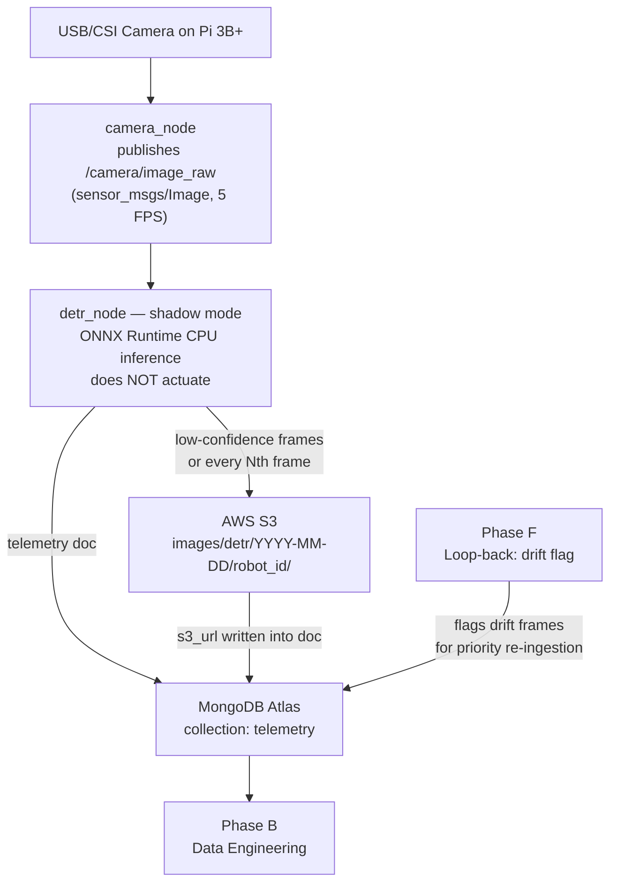

# Phase A — Data Ingestion

**Goal:** Capture sensor data on the robot, run DETR in shadow mode (log predictions without actuating), and push images + metadata into durable cloud storage.

**Feeds into:** Phase B (data engineering), Phase F (loop-back trigger)

---

## Flow Diagram



---

## Sub-pipe 1 — camera_node

**Package:** `ros2_ws/src/camera_node/`

| Item | Detail |
|---|---|
| Tools | `cv_bridge`, `image_transport`, OpenCV, Python |
| Publishes | `/camera/image_raw` (`sensor_msgs/Image`) |
| Frame rate | 5 FPS (Pi 3B+ safe — DETR inference takes ~2-5s/frame) |
| Resolution | 640x480 default |
| Config | `config/camera_params.yaml` |

**camera_params.yaml:**
```yaml
camera_node:
  ros__parameters:
    device_index: 0
    width: 640
    height: 480
    fps: 5
    frame_id: "camera_link"
```

> Queue depth on the subscriber side should be 1 (drop old frames). Publishing faster than inference rate just accumulates stale frames.

---

## Sub-pipe 2 — detr_node (shadow mode)

**Package:** `ros2_ws/src/detr_node/`

| Item | Detail |
|---|---|
| Tools | ONNX Runtime (CPU), Python, `vision_msgs` |
| Subscribes | `/camera/image_raw` |
| Publishes | `/detr/detections` (`vision_msgs/Detection2DArray`) |
| Publishes | `/detr/shadow_metrics` (JSON string per frame) |
| Model path | Read from param: `/greengrass/v2/packages/artifacts/.../model.onnx` |
| Shadow flag | `shadow_mode: true` — runs inference, logs, does NOT send actuation commands |

**detr_params.yaml:**
```yaml
detr_node:
  ros__parameters:
    model_path: "/models/detr/model.onnx"
    shadow_mode: true
    confidence_threshold: 0.6       # frames below this are uploaded to S3
    upload_every_nth_frame: 30      # fallback upload regardless of confidence
    robot_id: "pi3b-001"
    architecture: "detr"
```

**Shadow metrics document (per frame, goes to MongoDB):**
```json
{
  "timestamp": "2026-05-03T12:00:00Z",
  "robot_id": "pi3b-001",
  "architecture": "detr",
  "mean_confidence": 0.73,
  "num_detections": 3,
  "class_distribution": {"person": 2, "chair": 1},
  "s3_url": "s3://your-bucket/images/detr/2026-05-03/pi3b-001/frame_001.jpg",
  "source": "shadow"
}
```

> `source` field is important: Phase F production frames use `"source": "production"`. Phase B queries filter by this field.

---

## Sub-pipe 3 — S3 image uploader

**Script:** `pipeline/phase_a/s3_uploader.py`

| Item | Detail |
|---|---|
| Tools | `boto3`, Python |
| Trigger | Upload if `mean_confidence < 0.6` OR every 30th frame |
| S3 path | `s3://BUCKET/images/detr/YYYY-MM-DD/robot_id/frame_NNN.jpg` |
| S3 object metadata | `confidence`, `robot_id`, `timestamp`, `architecture` |
| Returns | S3 URL written back into telemetry document |

Upload strategy rationale:
- Low-confidence frames = most informative for training (active learning)
- Every-30th-frame = ensures dataset diversity even in high-confidence scenes
- Avoid uploading everything — Pi 3B+ bandwidth and S3 cost

---

## Sub-pipe 4 — MongoDB telemetry writer

**Script:** `pipeline/phase_a/mongo_writer.py`

| Item | Detail |
|---|---|
| Tools | `pymongo`, Python |
| Collection | `telemetry` in MongoDB Atlas free cluster |
| Write mode | Batch insert every 10 frames (reduces free tier write ops) |
| Indexes | `timestamp`, `architecture`, `mean_confidence`, `source` |

---

## Sub-pipe 5 — Phase F loop-back (pre-wired, activated in Phase F)

When Phase F detects drift:
- Writes flag document to `retrain_queue` collection in MongoDB
- Phase A ingestion script checks `retrain_queue` and re-tags recent high-drift frames as `source: "production_drift"`
- These frames get priority labeling queue in Phase B

This schema is defined now but the activation logic is built in Phase F.

---

## File Map

```
ros2_ws/src/
├── camera_node/
│   ├── package.xml
│   ├── setup.py
│   ├── camera_node/
│   │   ├── __init__.py
│   │   └── camera_node.py
│   └── config/
│       └── camera_params.yaml
└── detr_node/
    ├── package.xml
    ├── setup.py
    ├── detr_node/
    │   ├── __init__.py
    │   ├── detr_node.py          # ROS2 node, shadow mode logic
    │   └── onnx_inference.py     # ONNX Runtime wrapper, pre/post-processing
    └── config/
        └── detr_params.yaml

pipeline/phase_a/
├── s3_uploader.py
├── mongo_writer.py
└── launch/
    └── phase_a.launch.py         # launches camera_node + detr_node together
```

---

## ROS2 Topic Architecture

```
/camera/image_raw   (sensor_msgs/Image)
        |
        v
   detr_node
        |
        +----> /detr/detections      (vision_msgs/Detection2DArray)
        +----> /detr/shadow_metrics  (std_msgs/String — JSON)
                        |
                        v
              mongo_writer + s3_uploader
              (run as separate Python processes, subscribe to /detr/shadow_metrics)
```

---

## Docker Context

At this phase, develop and test on your **workstation (amd64)** first. The `inference` and `ros2-stack` Docker images for Pi will be built in Phase E. For now:
- Run nodes directly with `ros2 run` on workstation
- Use a USB webcam as the camera source
- Point `model_path` to a locally exported DETR ONNX file (from Phase C)

---

## Acceptance Criteria

- [ ] `camera_node` publishes frames at 5 FPS visible in `ros2 topic echo /camera/image_raw`
- [ ] `detr_node` runs ONNX inference and publishes to `/detr/detections` in shadow mode
- [ ] MongoDB Atlas `telemetry` collection receives documents with all fields including `s3_url`
- [ ] S3 bucket receives images for frames below confidence threshold
- [ ] Phase B can query MongoDB by `architecture: "detr"` and get back S3 URLs for DVC pull
