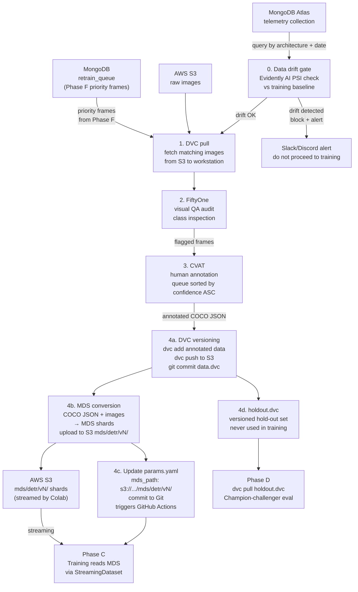

# Phase B — Data Engineering & Curation

**Goal:** Turn raw Phase A uploads into a trustworthy, versioned, audited dataset ready for training.

**Receives from:** Phase A (MongoDB telemetry + S3 images)
**Feeds into:** Phase C (training), Phase D (hold-out set)

---

## Flow Diagram



---

## Sub-pipe 0 — Data drift gate (runs BEFORE curation)

**Script:** `pipeline/phase_b/drift_gate.py`

| Item | Detail |
|---|---|
| Tools | Evidently AI, Python (PSI / KL-divergence stats) |
| Input | New batch from MongoDB vs stored training baseline distribution |
| Metrics | PSI on class frequency, mean pixel brightness, confidence score distribution |
| Block threshold | PSI > 0.2 on any metric |
| Action on block | Send Discord/Slack alert, do NOT proceed to CVAT labeling |

**What counts as the baseline:** After your first training run (Phase C Round 1), save the training dataset distribution as `pipeline/phase_b/drift_baseline_detr.json`. All subsequent batches compare against it.

```json
{
  "architecture": "detr",
  "dataset_version": "v1.0",
  "class_frequency": {"person": 0.45, "chair": 0.30, "table": 0.25},
  "mean_confidence": 0.71,
  "mean_brightness": 128.4
}
```

> For Round 1 (first ever dataset), skip this gate — there is no baseline yet. Run it from Round 2 onward.

---

## Sub-pipe 1 — Dataset query & DVC pull

**Script:** `pipeline/phase_b/query_and_pull.py`

| Item | Detail |
|---|---|
| Tools | MongoDB Python driver (`pymongo`), DVC |
| Query A | Filter `telemetry` by `architecture: "detr"`, `source: "shadow"`, date range |
| Query B | Filter `retrain_queue` by `architecture: "detr"`, `retrain_priority: true` (Phase F drift frames — always include these first) |
| Output | Merged list of S3 URLs: priority frames first, then normal shadow frames |
| DVC | Download images from S3 to `data/detr/raw/`, then `dvc add data/detr/raw/` to track them |

DVC remote is configured to point to S3 bucket. `dvc add` hashes the local files and creates the `data.dvc` pointer — it does not re-upload files already in S3 if the cache is warm.

```bash
# example DVC remote setup (done once during infrastructure setup)
dvc remote add -d s3remote s3://your-bucket/dvc-cache
dvc remote modify s3remote region eu-central-1
```

```python
# query_and_pull.py — merge normal + priority frames
normal_frames = list(db.telemetry.find({
    "architecture": "detr", "source": "shadow",
    "timestamp": {"$gte": cutoff_date}
}))
priority_frames = list(db.retrain_queue.find({
    "architecture": "detr", "retrain_priority": True, "processed": False
}))
all_urls = [f["s3_url"] for f in priority_frames] + [f["s3_url"] for f in normal_frames]
# download from S3 to data/detr/raw/ ...
# mark priority frames as processed in retrain_queue
```

---

## Sub-pipe 2 — Visual QA with FiftyOne + active learning queue

**Script:** `pipeline/phase_b/fiftyOne_qa.py`

| Item | Detail |
|---|---|
| Tools | FiftyOne, Python |
| Input | Locally pulled images (from DVC) + MongoDB metadata |
| Purpose | Visual inspection for corrupted frames, mislabeled data, class imbalance |
| Active learning | Load `mean_confidence` from MongoDB, sort frames ascending — lowest confidence shown first |

**Active learning wiring:**
```python
# sort by ascending confidence = most informative frames first
dataset.sort_by("mean_confidence", reverse=False)
```

Frames flagged as bad in FiftyOne are excluded from the CVAT labeling queue. Frames flagged as high-priority (low confidence) go to the front of the queue.

---

## Sub-pipe 3 — CVAT annotation

| Item | Detail |
|---|---|
| Tools | CVAT (self-hosted locally via Docker, or CVAT cloud) |
| Format | COCO JSON (compatible with DETR, Mask2Former, RT-DETR) |
| Queue order | Sorted by `mean_confidence` ASC (active learning from sub-pipe 2) |
| Label schema | Define object classes in `pipeline/phase_b/label_schema.yaml` — keep consistent across all architecture rounds |

**label_schema.yaml** (example for indoor robot scene):
```yaml
architecture: detr
classes:
  - id: 0
    name: person
  - id: 1
    name: chair
  - id: 2
    name: table
  - id: 3
    name: door
annotation_format: coco_json
```

> Keep the same label schema for all architecture rounds. This lets you compare models on the same classes.

---

## Sub-pipe 4a — DVC versioning

**Script:** `pipeline/phase_b/publish_dataset.py`

| Item | Detail |
|---|---|
| Tools | DVC, Git |
| Actions | 1. `dvc add data/detr/raw/` — hash annotated images, update `data.dvc` 2. `dvc push` — sync new images to S3 DVC cache 3. `git add data/detr/data.dvc && git commit` — version the pointer |
| Git commit message | `"data: detr dataset v{N} — {num_images} images, {classes} classes"` |

This step versions the raw annotated images. The MDS shards (next step) are derived from these and stored separately.

---

## Sub-pipe 4b — MDS conversion

**Script:** `pipeline/phase_b/convert_to_mds.py`

| Item | Detail |
|---|---|
| Tools | `mosaicml-streaming` (pip: `streaming`), Python |
| Input | Annotated images in `data/detr/raw/` + COCO JSON from CVAT |
| Output | MDS shards uploaded to `s3://your-bucket/mds/detr/v{N}/` |
| Why MDS | Colab can stream shards directly from S3 without downloading the full dataset — critical for large datasets and Colab's storage limits |

```python
# convert_to_mds.py — convert COCO annotated dataset to MDS shards
from streaming import MDSWriter
import json, os
from PIL import Image

out_path = f"s3://your-bucket/mds/detr/v{VERSION}/"

columns = {"image": "jpeg", "annotations": "json", "image_id": "int"}

with MDSWriter(out=out_path, columns=columns) as writer:
    for img_info in coco_data["images"]:
        img_id = img_info["id"]
        img = Image.open(f"data/detr/raw/{img_info['file_name']}")
        anns = [a for a in coco_data["annotations"] if a["image_id"] == img_id]
        writer.write({
            "image": img,
            "annotations": anns,
            "image_id": img_id
        })

print(f"MDS shards written to {out_path}")
```

> MDS writes directly to S3 (no local intermediate needed). Requires `AWS_ACCESS_KEY_ID` and `AWS_SECRET_ACCESS_KEY` in environment.

---

## Sub-pipe 4c — Update params.yaml with new mds_path

After MDS conversion, update `params.yaml` to point at the new shard version and commit to Git. This commit is what **triggers the GitHub Actions training workflow** in Phase C.

```yaml
# pipeline/phase_c/detr/params.yaml — update after every dataset version
dataset:
  mds_path: "s3://your-bucket/mds/detr/v2/"    # ← bumped from v1 to v2
  holdout_path: "s3://your-bucket/data/detr/holdout/"
  dataset_version: "v2"
  num_classes: 4
```

```bash
git add pipeline/phase_c/detr/params.yaml
git commit -m "data: bump mds_path to detr v2 — triggers training CI"
git push
# → GitHub Actions ci_deploy.yml fires on this push
```

---

## Sub-pipe 4d — Hold-out set management

**File:** `data/detr/holdout.dvc`

| Item | Detail |
|---|---|
| Tools | DVC, Git |
| What it is | A curated slice of representative edge cases — NEVER used in training |
| Size | ~10-15% of total labeled data, minimum 100 images |
| Update policy | Update intentionally (not every cycle) — only when new scene types are added |
| Used in | Phase D champion-challenger comparison |

The hold-out set must be committed separately from `data.dvc`. Having two separate DVC pointers enforces the separation.

```bash
# creating the hold-out DVC artifact
dvc add data/detr/holdout/        # holdout images directory
git add data/detr/holdout.dvc data/detr/.gitignore
git commit -m "data: add versioned DETR hold-out set v1"
```

---

## params.yaml (preprocessing config — versioned)

**File:** `pipeline/phase_c/detr/params.yaml`

> Defined here in Phase B because preprocessing decisions are made during curation, not during training. Training just reads this file.

```yaml
preprocessing:
  image_size: [800, 800]        # DETR standard input
  normalize_mean: [0.485, 0.456, 0.406]   # ImageNet mean
  normalize_std: [0.229, 0.224, 0.225]    # ImageNet std
  augmentation:
    horizontal_flip: true
    color_jitter: 0.4
    random_crop: false          # DETR is sensitive to crop, keep false initially
dataset:
  train_split: 0.85
  val_split: 0.15
  mds_path: "s3://your-bucket/mds/detr/v1/"
  holdout_path: "s3://your-bucket/data/detr/holdout/"
```

Any change to this file auto-triggers the GitHub Actions training workflow (Phase C).

---

## File Map

```
pipeline/phase_b/
├── drift_gate.py               # Sub-pipe 0: PSI check vs baseline, blocks if drift > 0.2
├── drift_baseline_detr.json    # saved distribution after first training round (Phase C output)
├── query_and_pull.py           # Sub-pipe 1: MongoDB query (telemetry + retrain_queue) + S3 download
├── fiftyone_qa.py              # Sub-pipe 2: visual audit, confidence-sorted CVAT queue
├── publish_dataset.py          # Sub-pipe 4a: dvc add + dvc push + git commit data.dvc
├── convert_to_mds.py           # Sub-pipe 4b: COCO JSON + images → MDS shards → S3
└── label_schema.yaml           # class definitions, shared across all architecture rounds

data/detr/
├── raw/                        # locally pulled images (gitignored, tracked by DVC)
├── data.dvc                    # DVC pointer to training images in S3
├── holdout/                    # holdout images (gitignored, tracked by DVC)
├── holdout.dvc                 # DVC pointer to hold-out set in S3
└── .gitignore                  # ignore raw/ and holdout/ dirs, track only .dvc files
```

---

## Acceptance Criteria

- [ ] Drift gate runs against new batch and produces PSI scores vs baseline
- [ ] `query_and_pull.py` fetches priority frames from `retrain_queue` first, then normal `telemetry` frames
- [ ] Images downloaded from S3 to `data/detr/raw/` correctly
- [ ] FiftyOne loads dataset with `mean_confidence` scores from MongoDB metadata
- [ ] CVAT receives frames sorted by ascending confidence (lowest = most informative first)
- [ ] `data/detr/data.dvc` committed to Git after annotation round (`dvc push` succeeded)
- [ ] `convert_to_mds.py` runs without errors and MDS shards appear in `s3://your-bucket/mds/detr/v{N}/`
- [ ] MDS shards readable in a Colab notebook via `StreamingDataset` (test this before Phase C)
- [ ] `params.yaml` `mds_path` updated to new version and committed to Git
- [ ] Git push triggers GitHub Actions `ci_deploy.yml` (check Actions tab)
- [ ] `data/detr/holdout.dvc` committed separately, never overlapping with training split
