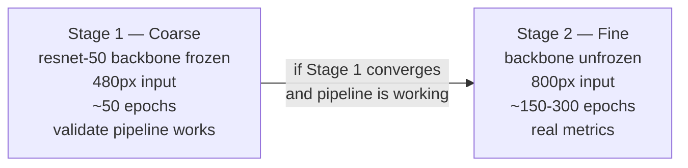

# Phase C — Training (DETR on Colab Pro+)

**Goal:** Automate model training, track experiments reproducibly, and register a new challenger model in MLflow.

**Receives from:** Phase B — two things:
- `params.yaml` with `mds_path` pointing to versioned MDS shards in S3
- MDS shards at `s3://your-bucket/mds/detr/v{N}/` (streamed directly into Colab, no full download)

**Feeds into:** Phase D (challenger model in MLflow Staging, `.pt` weights saved to S3)

---

## Why Colab Pro+ and Not AWS EC2

| Option | Cost | Notes |
|---|---|---|
| Colab Pro+ | ~$13/month | A100 40GB access, easiest for personal project |
| AWS p3.2xlarge (V100) | ~$3/hour | 50 epochs ≈ $30-60 — burns budget fast |
| AWS g4dn.xlarge (T4) | ~$0.53/hour | Slower but cheaper option if needed |

**Decision:** Use Colab Pro+ for all training. GitHub Actions triggers quantization + packaging (not raw training). The training Docker image (in ECR) is used for local training on your workstation if needed — not for Colab.

---

## Coarse-to-Fine Training Strategy



**For Round 1 (your first run): do Stage 1 only.** The goal is to prove the full A→F pipeline works end to end. Stage 2 is for when you want to report real benchmark numbers on your CV.

---

## Model Choice: Conditional DETR (not vanilla DETR)

| Model | HuggingFace ID | Convergence | Notes |
|---|---|---|---|
| Vanilla DETR | `facebook/detr-resnet-50` | ~500 epochs | Too slow for personal project |
| Conditional DETR | `microsoft/conditional-detr-resnet-50` | ~50 epochs | **Use this** — same concept, 10x faster |
| RT-DETR | `PekingU/rtdetr_r50vd` | ~72 epochs | Round 2 target |

Use `microsoft/conditional-detr-resnet-50` as the starting checkpoint. It's the same transformer detection architecture concept (you learn the same things), but converges in a reasonable time on Colab.

---

## CI/CD Trigger — GitHub Actions

**File:** `.github/workflows/ci_deploy.yml`

Triggers:
1. `params.yaml` change committed to Git → GitHub Actions detects it → triggers quantization + packaging workflow
2. Manual `workflow_dispatch` from GitHub UI
3. Phase F drift alert → `workflow_dispatch` with `retrain: true` payload

**What GitHub Actions does NOT do:** Run the training itself. Training is manual on Colab (you run the notebook). GitHub Actions runs after training — quantize, package, push to ECR, deploy.

```yaml
# .github/workflows/ci_deploy.yml (simplified)
on:
  push:
    paths:
      - 'pipeline/phase_c/detr/params.yaml'
  workflow_dispatch:
    inputs:
      model_run_id:
        description: 'MLflow run ID of trained model'
        required: true
```

---

## Training Notebook Structure (Colab)

**File:** `pipeline/phase_c/detr/train.py` (also used as Colab notebook cells)

### Cell 1 — Setup & Auth
```python
# install deps — note: mosaicml-streaming required to read MDS shards from S3
!pip install transformers torch torchvision mlflow dagshub dvc[s3] \
             optimum[onnxruntime] mosaicml-streaming pyyaml pycocotools boto3

# auth to DagsHub (sets MLflow tracking URI automatically)
import dagshub
dagshub.init(repo_owner="YOUR_USER", repo_name="YOUR_REPO", mlflow=True)

import mlflow
mlflow.set_experiment("detr-round1")
```

### Cell 2 — Clone repo & load params.yaml (no full dataset download needed)
```python
import os, yaml

# set AWS credentials (use Colab Secrets — left panel → key icon)
os.environ["AWS_ACCESS_KEY_ID"] = userdata.get("AWS_ACCESS_KEY_ID")
os.environ["AWS_SECRET_ACCESS_KEY"] = userdata.get("AWS_SECRET_ACCESS_KEY")

# clone the repo to get params.yaml and script files
# (dataset is NOT downloaded — it streams from S3 via MDS)
!git clone https://github.com/YOUR_USER/YOUR_REPO.git
%cd YOUR_REPO

# load params — mds_path tells us where Phase B put the MDS shards
with open("pipeline/phase_c/detr/params.yaml") as f:
    params = yaml.safe_load(f)

mds_path = params["dataset"]["mds_path"]          # e.g. s3://your-bucket/mds/detr/v2/
image_size = params["preprocessing"]["image_size"] # [800, 800]
mean = params["preprocessing"]["normalize_mean"]
std = params["preprocessing"]["normalize_std"]
num_classes = params["dataset"]["num_classes"]

print(f"Training on MDS dataset: {mds_path}")
```

> **Why no `dvc pull`?** Phase B converted the dataset to MDS shards and pushed them to S3. Colab streams shards on demand using `StreamingDataset` — no need to download all images upfront. This works even on Colab's limited disk space.

### Cell 3 — MDS DataLoader (streams directly from S3)
```python
from streaming import StreamingDataset
from torch.utils.data import DataLoader
from torchvision import transforms
import torch

# preprocessing transforms loaded from params.yaml
transform = transforms.Compose([
    transforms.Resize(image_size),
    transforms.ToTensor(),
    transforms.Normalize(mean=mean, std=std)
])

class DETRStreamingDataset(StreamingDataset):
    def __getitem__(self, idx):
        sample = super().__getitem__(idx)
        image = transform(sample["image"])
        annotations = sample["annotations"]   # COCO-format list of dicts
        return image, annotations

# train/val split defined in params.yaml
train_dataset = DETRStreamingDataset(
    local="/tmp/mds_cache/train",   # local shard cache (auto-managed)
    remote=mds_path + "train/",    # streams from S3
    shuffle=True
)
val_dataset = DETRStreamingDataset(
    local="/tmp/mds_cache/val",
    remote=mds_path + "val/",
    shuffle=False
)

train_loader = DataLoader(train_dataset, batch_size=4, num_workers=2, collate_fn=collate_fn)
val_loader   = DataLoader(val_dataset,   batch_size=4, num_workers=2, collate_fn=collate_fn)

print(f"Train: {len(train_dataset)} samples | Val: {len(val_dataset)} samples")
```

> The `local` path is a local disk cache for downloaded shards. MosaicML Streaming downloads shards on demand and evicts old ones to stay within disk budget.

### Cell 4 — Training loop (Stage 1 coarse)
```python
from transformers import AutoModelForObjectDetection, AutoImageProcessor
import mlflow

processor = AutoImageProcessor.from_pretrained("microsoft/conditional-detr-resnet-50")

model = AutoModelForObjectDetection.from_pretrained(
    "microsoft/conditional-detr-resnet-50",
    num_labels=num_classes,
    ignore_mismatched_sizes=True
).cuda()

# freeze backbone for Stage 1 (coarse)
for name, param in model.model.backbone.named_parameters():
    param.requires_grad = False

optimizer = torch.optim.AdamW(
    filter(lambda p: p.requires_grad, model.parameters()), lr=1e-4
)

with mlflow.start_run(run_name="detr-stage1-coarse"):
    mlflow.log_params({
        "model": "conditional-detr-resnet-50",
        "stage": "coarse",
        "image_size": image_size,
        "backbone_frozen": True,
        "epochs": 50,
        "mds_path": mds_path,
        "dataset_version": params["dataset"]["dataset_version"]
    })

    for epoch in range(50):
        model.train()
        for images, annotations in train_loader:
            outputs = model(pixel_values=images.cuda(), labels=annotations)
            loss = outputs.loss
            optimizer.zero_grad()
            loss.backward()
            optimizer.step()

        # validation
        map50 = evaluate(model, val_loader)  # your eval function
        mlflow.log_metric("val_loss", loss.item(), step=epoch)
        mlflow.log_metric("map50", map50, step=epoch)

    # save .pt weights to S3 (Phase E CI will pull from here)
    torch.save(model.state_dict(), "/tmp/detr_weights.pt")
    import boto3
    s3 = boto3.client("s3")
    s3.upload_file("/tmp/detr_weights.pt", "your-bucket",
                   f"weights/detr/v{params['dataset']['dataset_version']}/model.pt")

    mlflow.pytorch.log_model(model, "model")
    print("Weights saved to S3 and MLflow")
```

### Cell 5 — Register model in MLflow
```python
run_id = mlflow.active_run().info.run_id
model_uri = f"runs:/{run_id}/model"

client = mlflow.tracking.MlflowClient()
result = client.create_registered_model("detr-conditional-resnet50")
client.create_model_version(
    name="detr-conditional-resnet50",
    source=model_uri,
    run_id=run_id,
    tags={"stage": "coarse", "architecture": "detr", "dataset_version": "v1"}
)
# tag as Staging — NOT production yet
client.transition_model_version_stage(
    name="detr-conditional-resnet50",
    version=1,
    stage="Staging"
)
print(f"Model registered. Run ID: {run_id}")
```

> Copy the `run_id` — you'll need it to trigger the GitHub Actions `ci_deploy.yml` workflow manually.

---

## ONNX Export & INT8 Quantization

**Script:** `pipeline/phase_c/detr/export_onnx.py`

This runs inside the **training Docker image** on your workstation (or in GitHub Actions), NOT on Colab.

```python
# Step 1: Export to ONNX using HuggingFace Optimum
# CLI: optimum-cli export onnx --model microsoft/conditional-detr-resnet-50 ./detr_onnx/

# Step 2: INT8 quantization
from onnxruntime.quantization import quantize_dynamic, QuantType

quantize_dynamic(
    model_input="detr_onnx/model.onnx",
    model_output="detr_onnx/model_int8.onnx",
    weight_type=QuantType.QInt8
)
```

After quantization, upload `model_int8.onnx` to S3:
```
s3://your-bucket/weights/detr/v{N}/model_int8.onnx
```

This S3 path is what the Greengrass component recipe references in Phase E.

---

## MLflow Tracking on DagsHub

DagsHub hosts your MLflow server for free. Every `mlflow.log_*` call from Colab goes to DagsHub.

```
MLflow tracking URI: https://dagshub.com/YOUR_USER/YOUR_REPO.mlflow
DVC remote:         https://dagshub.com/YOUR_USER/YOUR_REPO.dvc
```

You can view all experiments at `https://dagshub.com/YOUR_USER/YOUR_REPO` — looks good on a CV/portfolio link.

---

## What the Training Docker Image Is For

The `training` Docker image in ECR is used for:
1. **ONNX export + quantization** step (reproducible environment, runs in GitHub Actions)
2. **Local training on your workstation** if you don't want to use Colab for a small experiment
3. **Future:** Could be used in a cloud training job if you upgrade beyond Colab

It is **not** used for Colab training — Colab manages its own environment.

**Dockerfile:** `docker/training/Dockerfile`
```dockerfile
FROM pytorch/pytorch:2.2.0-cuda12.1-cudnn8-runtime
RUN pip install transformers optimum[onnxruntime] mlflow dagshub \
                dvc[s3] pyyaml mosaicml-streaming pycocotools boto3
WORKDIR /workspace
COPY pipeline/phase_c/ ./phase_c/
COPY pipeline/phase_b/drift_baseline_detr.json ./phase_b/drift_baseline_detr.json
```

---

## After Round 1 — Save the Drift Baseline

After your very first training run completes, save the training dataset distribution to `pipeline/phase_b/drift_baseline_detr.json`. Phase B's drift gate uses this from Round 2 onward.

```python
# run after Round 1 training, on the training data (not holdout)
import json

baseline = {
    "architecture": "detr",
    "dataset_version": params["dataset"]["dataset_version"],
    "class_frequency": class_freq_from_train_annotations,  # e.g. {"person": 0.45, ...}
    "mean_confidence": float(mean_confidence_on_val),
    "mean_brightness": float(mean_brightness_of_train_images)
}
with open("pipeline/phase_b/drift_baseline_detr.json", "w") as f:
    json.dump(baseline, f, indent=2)

# commit it
# git add pipeline/phase_b/drift_baseline_detr.json
# git commit -m "data: save detr v1 drift baseline"
```

---

## File Map

```
pipeline/phase_c/
└── detr/
    ├── train.py               # Colab training notebook (Cells 1-5 above)
    ├── export_onnx.py         # ONNX INT8 export, runs in training Docker / GitHub Actions
    ├── params.yaml            # versioned config: mds_path, image_size, normalization
    └── model_card_template.md # filled in by Phase D generate_model_card.py

pipeline/phase_b/
└── drift_baseline_detr.json   # saved HERE after Round 1 training (read by Phase B drift gate)

docker/training/
└── Dockerfile                 # amd64, PyTorch + HuggingFace + MLflow + mosaicml-streaming

.github/workflows/
└── ci_deploy.yml              # triggered after training: quantize → build → ECR → Greengrass
```

---

## Acceptance Criteria

- [ ] `StreamingDataset` connects to MDS shards in S3 and iterates without errors (test Cell 3 independently)
- [ ] Colab Stage 1 training runs to completion, loss decreasing over epochs
- [ ] MLflow run visible on DagsHub with all params + metrics logged
- [ ] `.pt` weights uploaded to `s3://your-bucket/weights/detr/v{N}/model.pt` from Colab
- [ ] Model registered in MLflow registry as `Staging`
- [ ] `export_onnx.py` produces `model_int8.onnx` that runs inference correctly (test locally with a sample image)
- [ ] `model_int8.onnx` uploaded to S3 at `s3://your-bucket/weights/detr/v{N}/model_int8.onnx`
- [ ] GitHub Actions `ci_deploy.yml` triggered successfully (manual dispatch with `model_run_id`)
- [ ] Training Docker image builds and pushes to ECR without errors
- [ ] After Phase C, save `drift_baseline_detr.json` to `pipeline/phase_b/` — this is the Phase B drift baseline for Round 2 onward
