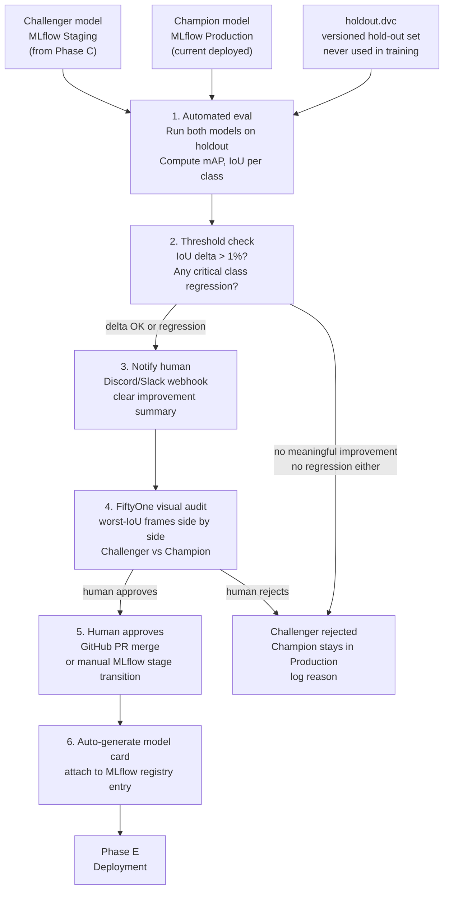

# Phase D — Validation & Human Audit

**Goal:** Compare challenger model vs champion on the held-out test set, get human sign-off, generate a model card, and promote the model to Production in MLflow Registry.

**Receives from:**
- Phase C: challenger model in MLflow Staging + `.pt` weights in S3
- Phase B: versioned `holdout.dvc` pointer (pull images to workstation before eval)

**Feeds into:** MLflow Production stage + `model_int8.onnx` on S3 (consumers outside this repo, if any)

---

## Flow Diagram



---

## Sub-pipe 0 — Pull hold-out set from DVC (pre-step)

Before running any eval, the holdout images must be on disk. They are tracked by DVC, not stored in Git.

```bash
# run on workstation before eval
dvc pull data/detr/holdout.dvc
# → downloads holdout images to data/detr/holdout/ from S3
```

This is a one-time pull per machine. If the `holdout.dvc` pointer changes (new holdout version), pull again.

---

## Sub-pipe 1 — Automated Champion-Challenger Evaluation

**Script:** `pipeline/phase_d/eval_champion_challenger.py`

| Item | Detail |
|---|---|
| Tools | MLflow Client API, Python, `pycocotools` for mAP, ONNX Runtime |
| Inputs | Challenger run ID (from Phase C), `model_int8.onnx` from S3, holdout images from `data/detr/holdout/` |
| Metrics | mAP@50, mAP@50:95, per-class IoU, inference latency (ms) |

```python
from mlflow.tracking import MlflowClient

client = MlflowClient()

# get challenger (latest Staging)
challenger = client.get_latest_versions("detr-conditional-resnet50", stages=["Staging"])[0]
# get champion (current Production)
champion = client.get_latest_versions("detr-conditional-resnet50", stages=["Production"])[0]

# run both on holdout set, compute metrics
# ...

results = {
    "challenger_map50": 0.62,
    "champion_map50": 0.58,
    "delta_map50": 0.04,
    "critical_class_regression": False,
    "challenger_latency_ms": 3100,
    "champion_latency_ms": 3050
}
```

> Round 1 has no champion (first ever model). In this case, automatically approve if mAP exceeds a minimum threshold defined in the workflow.

---

## Sub-pipe 2 — Threshold Policy

**Defined in:** `.github/workflows/ci_deploy.yml` as environment variables

```yaml
env:
  MIN_IOU_DELTA: 0.01          # must improve by at least 1% mAP
  CRITICAL_REGRESSION_CLASSES: "person,door"   # always alert on ANY regression in these
```

Alert logic:
- **Always alert** if any `CRITICAL_REGRESSION_CLASSES` show regression (even tiny)
- **Alert on improvement** only if `delta > MIN_IOU_DELTA` (avoids noise for trivial gains)
- **Silent reject** if improvement is below `MIN_IOU_DELTA` and no regression — don't deploy, don't bother the human

---

## Sub-pipe 3 — Human Notification (Discord/Slack)

**Script:** `pipeline/phase_d/notify_audit.py`

The webhook message should be informative enough that you don't need to open MLflow to decide:

```
[DETR Audit Request] v2 vs v1 — 2026-05-03

Challenger (v2):  mAP@50 = 0.62  (+0.04 vs champion)
Champion (v1):    mAP@50 = 0.58
Latency (p95):    3100ms vs 3050ms (+50ms)

Per-class delta:
  person: +0.06  ✓
  chair:  +0.02  ✓
  door:   -0.01  ⚠ CRITICAL CLASS REGRESSION

Holdout set: holdout.dvc @ v1 (100 images)
MLflow run: https://dagshub.com/...

Action needed: Review FiftyOne audit, then approve PR #42 or close it.
```

---

## Sub-pipe 4 — FiftyOne Visual Audit

**Script:** `pipeline/phase_d/fiftyone_audit.py`

| Item | Detail |
|---|---|
| Tools | FiftyOne, Python |
| Input | Holdout set images + predictions from both Champion and Challenger |
| View | Sort by IoU ascending — worst cases first |
| Focus | Check critical class regressions identified in notification |

```python
import fiftyone as fo

# Load holdout dataset
dataset = fo.Dataset.from_dir(
    dataset_type=fo.types.COCODetectionDataset,
    data_path="data/detr/holdout/",
    labels_path="data/detr/holdout/annotations.json"
)

# Add challenger predictions
dataset.add_model_predictions(challenger_predictions, label_field="challenger")
# Add champion predictions
dataset.add_model_predictions(champion_predictions, label_field="champion")

# Sort by worst IoU
view = dataset.sort_by("eval_tp", reverse=False)
session = fo.launch_app(view)
```

Human reviewer looks at worst-performing frames side by side. Key question: **"Are the failure modes acceptable for the robot's use case?"**

---

## Sub-pipe 5 — Approval Mechanism

Two options (use whichever fits your workflow):

**Option A — GitHub PR merge (recommended for traceability)**
- GitHub Actions creates a PR titled `"Promote DETR v{N} — mAP delta +0.04"`
- PR description contains the full metric comparison
- Merging the PR triggers the next GitHub Actions step (Phase E packaging)
- PR merge = audit log of who approved and when

**Option B — MLflow Registry stage transition**
- Manually call: `client.transition_model_version_stage(name="...", version=N, stage="Production")`
- Phase E workflow polls MLflow Registry for `Production` models

> Option A is better for your CV story — it shows you understand DevOps/review workflows.

---

## Sub-pipe 6 — Model Card Generation

**Script:** `pipeline/phase_d/generate_model_card.py`
**Triggered:** Automatically on PR merge (GitHub Actions step)

Model card attached to the MLflow registry entry as a tag/artifact:

```markdown
# DETR Model Card — v{N}

## Training Data
- DVC hash: {data.dvc commit hash}
- Dataset version: v{N}
- Num images: {N}
- Classes: person, chair, table, door

## Performance on Hold-out Set (holdout.dvc v1)
- mAP@50: 0.62
- mAP@50:95: 0.41
- Per-class IoU: person=0.71, chair=0.65, table=0.58, door=0.44

## Comparison vs Champion
- Previous champion mAP@50: 0.58 (+0.04 improvement)
- Latency p95: 3100ms on Pi 3B+ CPU (ONNX INT8)

## Known Failure Modes
- Poor performance in low-light (< 50 lux) — not represented in training data
- Door class degrades with partial occlusion

## Approved Use Cases
- Shadow mode logging on indoor robot
- Not approved for actuation (shadow mode only at this stage)

## Approval
- Reviewer: {your name}
- Date: {date}
- PR: #{PR number}
```

This model card goes on your CV/portfolio as evidence of responsible ML practices.

---

## File Map

```
pipeline/phase_d/
├── eval_champion_challenger.py   # mAP comparison on holdout set
├── notify_audit.py               # Discord/Slack webhook with metric summary
├── fiftyone_audit.py             # visual worst-case comparison
├── generate_model_card.py        # auto-generates and logs card to MLflow
└── model_card_template.md        # template filled by generate_model_card.py
```

---

## Acceptance Criteria

- [ ] `eval_champion_challenger.py` runs on holdout set, produces metric comparison
- [ ] Threshold policy enforced — no trivial improvements trigger notification
- [ ] Discord/Slack message received with full metric summary and PR link
- [ ] FiftyOne audit view launches showing challenger vs champion worst cases
- [ ] PR approved by human reviewer
- [ ] Model card generated and attached to MLflow registry entry
- [ ] Challenger model stage transitions to `Production` in MLflow Registry
- [ ] Phase E workflow triggered automatically on PR merge
