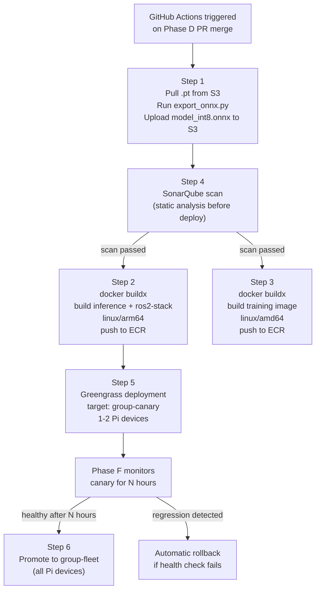

# Phase E — Deployment (Workstation → ECR → Pi 3B+ via Greengrass)

**Goal:** Package the approved model into Docker images, push to AWS ECR, and ship to the Raspberry Pi 3B+ via Greengrass — weights delivered via S3 component recipe, canary-first.

**Receives from:** Phase D (Production-tagged model in MLflow, `model_int8.onnx` in S3)
**Feeds into:** Phase F (running inference on Pi, monitoring loop)

> **Round 1 update (Pi 3B+):** Edge deploy uses a **single** Greengrass component **`com.robops.stack`** and image **`robops/ros2-full-stack`** (`robops-stack` container): camera + DETR + monitoring in one process group. Legacy split **`inference` + `ros2-stack`** images are optional. See [ROUND1_COMPLETION](../ROUND1_COMPLETION.md).

---

## Full Deployment Flow



---

## Pre-requisite: Pi 3B+ Setup

Before first Greengrass deployment, the Pi needs manual one-time setup:

1. **OS:** Install Raspberry Pi OS 64-bit. Verify: `uname -m` must return `aarch64`
2. **Docker:** Install Docker Engine for arm64
3. **Greengrass v2:** Install core device software
   ```bash
   curl -s https://d2s8p88vqu9w66.cloudfront.net/releases/greengrass-nucleus-latest.zip > greengrass-nucleus-latest.zip
   java -Droot="/greengrass/v2" -jar ./GreengrassInstaller/lib/Greengrass.jar \
     --aws-region eu-central-1 \
     --thing-name pi3b-001 \
     --component-default-user ggc_user:ggc_group \
     --provision true \
     --setup-system-service true
   ```
4. **Greengrass groups:** Create two groups in AWS Console:
   - `group-canary` — contains `pi3b-001` (your first Pi)
   - `group-fleet` — contains all Pis

---

## Sub-pipe 1 — ONNX Export & Quantization (CI step)

Already described in Phase C. In the CI context:

```yaml
# inside ci_deploy.yml
- name: Export and quantize model
  run: |
    docker run --rm \
      -e AWS_ACCESS_KEY_ID=${{ secrets.AWS_ACCESS_KEY_ID }} \
      -e AWS_SECRET_ACCESS_KEY=${{ secrets.AWS_SECRET_ACCESS_KEY }} \
      -v $(pwd):/workspace \
      $ECR_REGISTRY/training:latest \
      python /workspace/pipeline/phase_c/detr/export_onnx.py \
        --run-id ${{ github.event.inputs.model_run_id }} \
        --output s3://your-bucket/weights/detr/v${{ github.run_number }}/model_int8.onnx
```

---

## Sub-pipe 2 — Docker Build (Multi-arch via buildx)

**Critical:** The Pi 3B+ runs arm64. Your workstation is amd64. You must use `docker buildx` with QEMU emulation or cross-compilation to build arm64 images on your amd64 workstation.

### One-time setup on workstation (GitHub Actions runner):
```bash
docker buildx create --name multiarch --use
docker buildx inspect --bootstrap
# This enables linux/arm64 builds on amd64 host via QEMU
```

### GitHub Actions build step:
```yaml
- name: Build and push inference image (arm64)
  run: |
    docker buildx build \
      --platform linux/arm64 \
      --tag $ECR_REGISTRY/inference:$IMAGE_TAG \
      --push \
      docker/inference/

- name: Build and push ros2-stack image (arm64)
  run: |
    docker buildx build \
      --platform linux/arm64 \
      --tag $ECR_REGISTRY/ros2-stack:$IMAGE_TAG \
      --push \
      docker/ros2-stack/
```

### Dockerfiles

**`docker/inference/Dockerfile`** (arm64 — ONNX Runtime + detr_node):
```dockerfile
FROM arm64v8/ros:jazzy-ros-base
RUN apt-get update && apt-get install -y python3-pip
RUN pip3 install onnxruntime pymongo boto3

# Copy detr_node ROS2 package
COPY ros2_ws/src/detr_node/ /ros2_ws/src/detr_node/
WORKDIR /ros2_ws
RUN . /opt/ros/jazzy/setup.sh && colcon build --packages-select detr_node

# Model path is injected by Greengrass at runtime
ENV MODEL_PATH=/greengrass/v2/packages/artifacts/inference-component/current/model_int8.onnx

ENTRYPOINT ["/bin/bash", "-c", ". /opt/ros/jazzy/setup.sh && . /ros2_ws/install/setup.sh && ros2 run detr_node detr_node"]
```

**`docker/ros2-stack/Dockerfile`** (arm64 — camera_node + monitoring_node):
```dockerfile
FROM arm64v8/ros:jazzy-ros-base
RUN apt-get update && apt-get install -y python3-pip python3-opencv
RUN pip3 install pymongo boto3

COPY ros2_ws/src/camera_node/ /ros2_ws/src/camera_node/
COPY ros2_ws/src/monitoring_node/ /ros2_ws/src/monitoring_node/
WORKDIR /ros2_ws
RUN . /opt/ros/jazzy/setup.sh && colcon build

ENTRYPOINT ["/bin/bash", "-c", ". /opt/ros/jazzy/setup.sh && . /ros2_ws/install/setup.sh && ros2 launch phase_a.launch.py"]
```

> Use `arm64v8/ros:jazzy-ros-base` not `ros:jazzy-desktop` — desktop variant is ~2GB larger and unnecessary.

---

## Sub-pipe 3 — Greengrass Component Recipes

The key insight: **weights come from S3 via the recipe, not from inside the Docker image.** This means you can update the model without rebuilding the Docker image.

**`greengrass/components/inference-component/recipe.json`:**
```json
{
  "RecipeFormatVersion": "2020-01-25",
  "ComponentName": "com.example.inference",
  "ComponentVersion": "1.0.0",
  "ComponentDescription": "DETR ONNX inference node",
  "ComponentPublisher": "you",
  "Artifacts": [
    {
      "URI": "s3://your-bucket/weights/detr/v1/model_int8.onnx",
      "Unarchive": "NONE",
      "Permission": {
        "Read": "OWNER"
      }
    }
  ],
  "Lifecycle": {
    "Run": "docker run --rm \
      --env MODEL_PATH={artifacts:path}/model_int8.onnx \
      --env MONGO_URI={secrets:mongodb_uri} \
      --env ROBOT_ID=pi3b-001 \
      --network host \
      YOUR_ECR_URI/inference:latest"
  }
}
```

**`greengrass/components/ros2-stack-component/recipe.json`:**
```json
{
  "RecipeFormatVersion": "2020-01-25",
  "ComponentName": "com.example.ros2stack",
  "ComponentVersion": "1.0.0",
  "Lifecycle": {
    "Run": "docker run --rm \
      --env MONGO_URI={secrets:mongodb_uri} \
      --env ROBOT_ID=pi3b-001 \
      --device /dev/video0:/dev/video0 \
      --network host \
      YOUR_ECR_URI/ros2-stack:latest"
  }
}
```

Secrets (`MONGO_URI`, etc.) are pulled from AWS Secrets Manager at deployment time by Greengrass — never hardcoded in the recipe or Docker image.

---

## Sub-pipe 4 — Canary Rollout

```yaml
# GitHub Actions step — canary deploy
- name: Deploy to canary group
  run: |
    aws greengrassv2 create-deployment \
      --target-arn "arn:aws:iot:eu-central-1:ACCOUNT:thinggroup/group-canary" \
      --components '{
        "com.example.inference": {"componentVersion": "1.0.0"},
        "com.example.ros2stack": {"componentVersion": "1.0.0"}
      }'
```

Phase F monitors the canary device for N hours (configured as `CANARY_MONITOR_HOURS: 4`). If Phase F reports no regression, the fleet promotion step fires automatically.

---

## Sub-pipe 5 — Automatic Rollback

Defined in the Greengrass component recipe as a `rollbackConfig`:

```json
"rollbackConfig": {
  "failureHandlingPolicy": "ROLLBACK",
  "componentUpdatePolicy": {
    "failureHandlingPolicy": "ROLLBACK",
    "action": "NOTIFY_COMPONENTS"
  }
}
```

Health check script: `pipeline/phase_e/health_check.py`
- Checks: CPU usage < 95%, ROS2 nodes alive, inference latency within 3× baseline
- If health check fails within `POST_DEPLOY_WINDOW_MINUTES: 30`, Greengrass rolls back automatically
- Slack alert sent on rollback

---

## File Map

```
docker/
├── training/
│   └── Dockerfile             # amd64
├── inference/
│   └── Dockerfile             # arm64, ONNX Runtime + detr_node
└── ros2-stack/
    └── Dockerfile             # arm64, camera_node + monitoring_node

greengrass/components/
├── inference-component/
│   └── recipe.json            # S3 artifact: model_int8.onnx + ECR image
└── ros2-stack-component/
    └── recipe.json            # ECR image + device passthrough

pipeline/phase_e/
├── health_check.py            # post-deploy health check
└── promote_to_fleet.py        # runs after canary period if Phase F confirms healthy

.github/workflows/
└── ci_deploy.yml              # full pipeline: quantize → build → ECR → canary deploy
```

---

## AWS ECR Repo Setup (one-time)

```bash
aws ecr create-repository --repository-name training --region eu-central-1
aws ecr create-repository --repository-name inference --region eu-central-1
aws ecr create-repository --repository-name ros2-stack --region eu-central-1

# authenticate Docker to ECR
aws ecr get-login-password --region eu-central-1 | \
  docker login --username AWS --password-stdin YOUR_ACCOUNT_ID.dkr.ecr.eu-central-1.amazonaws.com
```

---

## Acceptance Criteria

- [ ] Pi 3B+ runs 64-bit OS (`uname -m` returns `aarch64`)
- [ ] Greengrass v2 installed and `pi3b-001` visible in AWS IoT Console
- [ ] `docker buildx` builds arm64 `inference` and `ros2-stack` images without errors
- [ ] All 3 images pushed to ECR repos
- [ ] Greengrass deploys to `group-canary`, Pi pulls image from ECR and weights from S3
- [ ] `detr_node` running inside container, publishing to `/detr/detections` on Pi
- [ ] Rollback triggers correctly on artificial health check failure test
- [ ] After canary period, `promote_to_fleet.py` deploys to `group-fleet`
