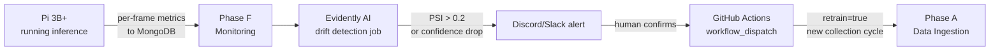

# Phase F — Production Monitoring & Retraining Loop

**Goal:** Detect model degradation and data drift on live Pi 3B+ devices. Fire the retraining loop back to Phase A before quality visibly degrades.

**Receives from:** Phase E (deployed model running in shadow/production mode on Pi)
**Triggers:** Phase A (new data collection cycle), Phase C (retraining dispatch)

---

## Why Phase F Closes the Loop

Without Phase F, the pipeline is a one-shot process: train → deploy → forget. Phase F is what makes it a **continuous loop**:



---

## Sub-pipe 1 — Edge Metrics Collection (monitoring_node on Pi)

**Package:** `ros2_ws/src/monitoring_node/`

| Item | Detail |
|---|---|
| Tools | ROS2 diagnostics, Python, `psutil`, `pymongo` |
| Subscribes | `/detr/shadow_metrics` (from detr_node) |
| Collects | Inference latency, confidence score, class distribution, CPU/memory, ROS2 node liveness |
| Writes | MongoDB Atlas `production_metrics` collection, batched every 10 frames |
| Source tag | `"source": "production"` — distinguishes from shadow training data |

**Production metrics document:**
```json
{
  "timestamp": "2026-05-03T14:00:00Z",
  "robot_id": "pi3b-001",
  "architecture": "detr",
  "model_version": "v2",
  "inference_latency_ms": 3100,
  "mean_confidence": 0.68,
  "class_distribution": {"person": 0.45, "chair": 0.35, "table": 0.20},
  "cpu_percent": 72.3,
  "memory_mb": 610,
  "ros_nodes_alive": ["camera_node", "detr_node", "monitoring_node"],
  "source": "production"
}
```

---

## Sub-pipe 2 — Drift & Degradation Detection

**Script:** `pipeline/phase_f/drift_detector.py`
**Run as:** Scheduled job on workstation (cron or GitHub Actions scheduled workflow, every 6 hours)

| Metric | Alert threshold | Meaning |
|---|---|---|
| `mean_confidence` | Drop > 10% vs training baseline | Model sees unfamiliar scenes |
| Class frequency PSI | > 0.2 | Scene distribution has shifted |
| Inference latency p95 | > 1.5× training benchmark | Performance degradation on Pi |
| ROS2 node liveness | Any critical node down | System health issue |

```python
import evidently
from evidently.report import Report
from evidently.metric_preset import DataDriftPreset
from evidently import ColumnMapping

# fetch recent production window (last 24h)
recent_docs = list(db.production_metrics.find({
    "architecture": "detr",
    "source": "production",
    "timestamp": {"$gte": datetime.utcnow() - timedelta(hours=24)}
}))

# compare against training baseline distribution
report = Report(metrics=[DataDriftPreset()])
report.run(reference_data=baseline_df, current_data=recent_df, column_mapping=column_mapping)

results = report.as_dict()
psi = results["metrics"][0]["result"]["dataset_drift"]

if psi > 0.2 or confidence_drop > 0.10:
    fire_alert(results)
    flag_frames_for_reingestion()
```

---

## Sub-pipe 3 — Retraining Trigger

**Script:** `pipeline/phase_f/retrain_trigger.py`

When drift confirmed:

1. **Flag high-drift frames in MongoDB** — set `retrain_priority: true` on production frames from the drift window. Phase B will pull these first.
2. **Fire GitHub Actions workflow_dispatch** — kicks off the full A→B→C cycle

```python
import requests

# trigger GitHub Actions workflow
response = requests.post(
    "https://api.github.com/repos/YOUR_USER/YOUR_REPO/actions/workflows/ci_deploy.yml/dispatches",
    headers={
        "Authorization": f"token {GITHUB_TOKEN}",
        "Accept": "application/vnd.github.v3+json"
    },
    json={
        "ref": "main",
        "inputs": {
            "trigger_reason": "phase_f_drift",
            "drift_metric": "confidence_drop",
            "drift_value": str(confidence_drop)
        }
    }
)
```

3. **Send alert to Discord/Slack:**
```
[Phase F Alert] DETR drift detected on pi3b-001 — 2026-05-03 14:00 UTC

Confidence mean: 0.62 (baseline: 0.71, drop: -12.7%) ⚠
Class freq PSI: 0.24 ⚠
Latency p95: 3400ms (benchmark: 3100ms, +9.7%) ✓

Action: Retraining cycle triggered automatically.
Priority frames flagged in MongoDB for Phase B.
GitHub Actions run: https://github.com/...
```

---

## Sub-pipe 4 — Observability Dashboard

**Script:** `pipeline/phase_f/dashboard.py`

FiftyOne loads production frames with low confidence or high drift for visual inspection — a continuous version of Phase D's worst-IoU comparison.

```python
import fiftyone as fo

# load low-confidence production frames for visual review
dataset = fo.Dataset.from_mongodb(
    db.production_metrics.find({
        "architecture": "detr",
        "source": "production",
        "mean_confidence": {"$lt": 0.6}
    })
)
session = fo.launch_app(dataset)
```

This is your ongoing monitoring view — run it locally whenever you want to visually inspect what the live model is struggling with.

---

## Canary Monitoring (used by Phase E)

After Phase E deploys to `group-canary`, Phase F runs a **focused 4-hour monitoring window**:

**Script:** `pipeline/phase_f/canary_monitor.py`

```python
CANARY_MONITOR_HOURS = 4
CANARY_DEVICE_IDS = ["pi3b-001"]

# poll MongoDB every 15 minutes for canary device metrics
# compare against pre-deployment baseline
# if no regression after CANARY_MONITOR_HOURS → call promote_to_fleet.py
# if regression → call Greengrass rollback + send alert
```

This script is called by the GitHub Actions `ci_deploy.yml` as the final step, running as a long-running job with a 4-hour timeout.

---

## MongoDB Collections Used in Phase F

| Collection | Written by | Read by |
|---|---|---|
| `production_metrics` | `monitoring_node` on Pi | Phase F drift detector |
| `retrain_queue` | Phase F `retrain_trigger.py` | Phase A ingestion loop |
| `drift_events` | Phase F | Observability dashboard, audit trail |

**`drift_events` document:**
```json
{
  "timestamp": "2026-05-03T14:00:00Z",
  "architecture": "detr",
  "model_version": "v2",
  "trigger": "confidence_drop",
  "drift_value": -0.127,
  "action": "retrain_dispatched",
  "github_run_url": "https://github.com/..."
}
```

This collection is your audit trail — you can show on your CV that you tracked not just model performance but also when and why retraining was triggered.

---

## File Map

```
ros2_ws/src/
└── monitoring_node/
    ├── package.xml
    ├── setup.py
    └── monitoring_node/
        ├── __init__.py
        └── monitoring_node.py    # subscribes to /detr/shadow_metrics, writes to MongoDB

pipeline/phase_f/
├── drift_detector.py             # scheduled job, Evidently AI PSI checks
├── retrain_trigger.py            # flags frames, fires GitHub Actions dispatch
├── canary_monitor.py             # 4-hour post-deploy monitoring window
└── dashboard.py                  # FiftyOne low-confidence production frame viewer

data/
└── drift_baselines/
    └── detr_v1_baseline.json     # saved distribution after first training round
```

---

## Scheduling the Drift Detector

Two options:

**Option A — GitHub Actions scheduled workflow (recommended, no infra needed):**
```yaml
# .github/workflows/drift_check.yml
on:
  schedule:
    - cron: '0 */6 * * *'    # every 6 hours
  workflow_dispatch:

jobs:
  drift-check:
    runs-on: self-hosted      # your workstation runner
    steps:
      - uses: actions/checkout@v4
      - run: python pipeline/phase_f/drift_detector.py
```

**Option B — cron on workstation:**
```bash
0 */6 * * * cd /home/serkanrob/Desktop/ros2_projects/project_ws && python pipeline/phase_f/drift_detector.py
```

Option A is better — it's tracked in Git, visible in GitHub Actions history, and integrates with the retrain workflow.

---

## Acceptance Criteria

- [ ] `monitoring_node` running on Pi, writing to MongoDB `production_metrics` collection
- [ ] Drift detector runs on schedule, PSI scores computed correctly
- [ ] Alert fires correctly on simulated drift (manually lower baseline threshold to test)
- [ ] Retraining workflow_dispatch triggered successfully from drift script
- [ ] Canary monitor runs after Phase E deploy, promotes to fleet on healthy signal
- [ ] Rollback triggered correctly when canary health check fails
- [ ] `drift_events` collection in MongoDB shows audit trail of drift detections
- [ ] FiftyOne dashboard loads low-confidence production frames for visual review
